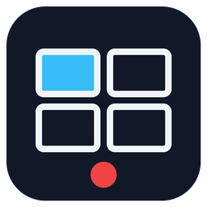

<p align="center">
  
</p>

<h1 align="center">VMS Multimarca</h1>

<p align="center">
  Videovigilancia para tiendas y oficinas con cámaras <b>Hikvision</b>, <b>Dahua</b> y <b>ONVIF</b> mezcladas,<br>
  sin licencia por cámara.
</p>

<p align="center">
  <a href="https://github.com/mauricioSas/vms-multimarca/releases/latest"></a>
</p>

<p align="center">
  <a href="https://github.com/mauricioSas/vms-multimarca/releases"></a>
  <a href="https://github.com/mauricioSas/vms-multimarca/actions/workflows/ci.yml?query=branch%3Av2"></a>
  
</p>

---

## Qué hace

| | |
|---|---|
| **Vista en vivo** | Muros de 1, 4, 9 o 16 cámaras en hasta 4 monitores; doble clic para pantalla completa. |
| **Grabación 24/7** | Retención por días y protección de disco: borra solo lo más antiguo. |
| **Reproducción** | Línea de tiempo, marcadores y descarga de clips. |
| **Evidencias** | Exporta un vídeo firmado con su acta, verificable por quien lo recibe. |
| **Salud de las cámaras** | Avisa si una cámara está tapada, desenfocada, movida, congelada o con la hora mal. |
| **Avisos** | Correo, Telegram o webhook; previsión de cuántos días de grabación caben. |
| **Analítica de tienda** *(opcional)* | Conteo anónimo de personas en la puerta y colas en cajas, con informe semanal. No guarda imágenes ni identifica a nadie. |
| **Panel central** *(opcional)* | Estado de todas las tiendas, conteos y comparativas en una sola pantalla. |
| **Actualizaciones seguras** | Firmadas; si una versión nueva falla, vuelve sola a la anterior. |

## Instalar en Windows

1. Descarga **`VMSMultimarca-Setup-<versión>.exe`** de la [última versión](https://github.com/mauricioSas/vms-multimarca/releases/latest).
2. Haz doble clic y responde **Sí** al aviso de permisos.
   Si Windows muestra «Windows protegió tu PC», pulsa **Más información → Ejecutar de todas formas** (el instalador
   todavía no está firmado con certificado de empresa).
3. Sigue el asistente: tipo de puesto, carpeta de grabaciones, nombre de la tienda y contraseña de **admin**.
4. Al terminar, abre el **visor** (acceso directo «VMS Multimarca») o el navegador en **http://127.0.0.1:8600** y
   da de alta las cámaras.

Guía completa, página por página: **[docs/INSTALACION-WINDOWS.md](docs/INSTALACION-WINDOWS.md)** ·
Requisitos de equipo: [docs/REQUISITOS-HARDWARE.md](docs/REQUISITOS-HARDWARE.md) ·
Dar de alta cámaras: [docs/ALTA-EQUIPOS.md](docs/ALTA-EQUIPOS.md) ·
Problemas frecuentes: [docs/PROBLEMAS.md](docs/PROBLEMAS.md)

Para comprobar la descarga, cada versión publica `SHA256SUMS.txt` y el inventario de componentes (SBOM).

## Cómo está hecho

```
 Cámaras / NVR (Hikvision · Dahua · ONVIF)
        │ RTSP
        ▼
 PC de la tienda (Windows) ── servicios que arrancan solos
   ├─ VMSEngine     motor de vídeo (MediaMTX): graba y sirve el vídeo en vivo
   ├─ VMSBackend    API y web (puerto 8600): equipos, muros, grabaciones, salud, evidencias, avisos
   ├─ VMSAnalytics  conteo de personas y colas (opcional)
   ├─ VMSHeartbeat  envía el estado al panel central (opcional)
   └─ VMSUpdater    actualizaciones firmadas con vuelta atrás automática
 Visor de escritorio (VMS.exe) en los monitores de vigilancia
```

Detalle técnico: [LEEME.md](LEEME.md) · contrato de interfaces: [docs/CONTRATO.md](docs/CONTRATO.md) ·
estado del proyecto: [docs/ESTADO.md](docs/ESTADO.md) · compilar el instalador: [docs/EMPAQUETADO.md](docs/EMPAQUETADO.md)

## Privacidad

La analítica solo guarda conteos anónimos: ni imágenes, ni vídeo, ni identificación de personas, ni medición de
trabajadores. Evaluación de impacto: [docs/RGPD-EIPD.md](docs/RGPD-EIPD.md).

## Licencia

Software propietario de Unmanned Studio. Todos los derechos reservados. El código es visible, pero no se concede
licencia de uso, copia ni distribución. Componentes de terceros y sus licencias: [THIRD_PARTY_NOTICES.txt](THIRD_PARTY_NOTICES.txt).
